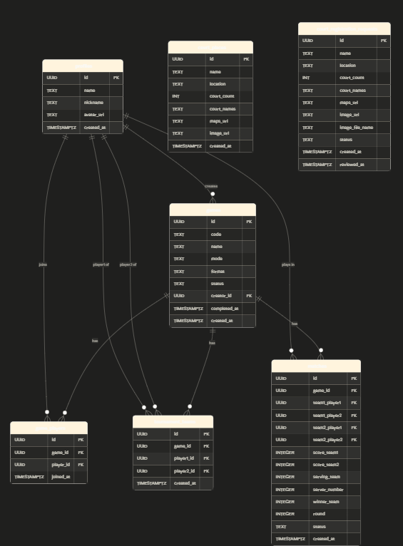

# 🏓 StackIt — Pickleball Game Manager

A full-stack app to manage pickleball games with Tournament brackets and Open Play fair rotation.

## Tech Stack

| Layer     | Technology                          |
|-----------|-------------------------------------|
| Frontend  | Next.js 14, TypeScript, Tailwind CSS |
| Backend   | Node.js, Express, TypeScript         |
| Database  | PostgreSQL via Supabase               |
| Auth      | Supabase Auth (email/password)        |
| Realtime  | Supabase Realtime                     |
| Storage   | Supabase Storage (avatars)            |

---

## Project Structure

```
stackit/
├── frontend/          # Next.js app
│   ├── app/           # App Router pages
│   ├── components/    # React components
│   ├── lib/           # Supabase client
│   └── store/         # Zustand state
├── backend/           # Express API
│   └── src/
│       ├── routes/    # API route handlers
│       ├── middleware/ # Auth middleware
│       └── lib/       # Supabase admin client
└── supabase_schema.sql  # Database schema
```

---

## Setup

### 1. Supabase Project

1. Create a project at [supabase.com](https://supabase.com)
2. In the SQL Editor, run the contents of `supabase_schema.sql`
3. Copy your **Project URL**, **anon key**, and **service role key** from Settings → API

### 2. Frontend

```bash
cd frontend
cp .env.example .env.local
# Fill in your Supabase URL and anon key
npm install
npm run dev
```

Open http://localhost:3000

### 3. Backend (optional — frontend talks to Supabase directly)

```bash
cd backend
cp .env.example .env
# Fill in your Supabase URL and service role key
npm install
npm run dev
```

API runs at http://localhost:4000

---

## Features

### Auth
- Email/password sign up & sign in via Supabase Auth
- Profile setup (name, nickname, avatar)

### Games
- **Create Game** — generates a 6-character code + QR code
- **Join Game** — enter code or scan QR
- **My Games** — view all joined games with status

### Tournament Mode 🏆
- Auto-generate bracket from joined players (randomized seeding)
- Score tracking per match (+ / − controls)
- Complete matches to record winner
- View standings in Scoreboard

### Open Play Mode 🎯
- Fair rotation queue — players who just played go to back of queue
- Live match score tracking
- Match history
- Scoreboard with W/L/PF/PA stats

### Realtime
- All score and player updates sync live across all connected clients (Supabase Realtime)

---

## API Endpoints (Backend)

```
GET    /health
GET    /api/profiles/me
POST   /api/profiles
PATCH  /api/profiles/me

GET    /api/games
POST   /api/games
GET    /api/games/:id
POST   /api/games/join
PATCH  /api/games/:id/status

GET    /api/matches?gameId=xxx
POST   /api/matches
PATCH  /api/matches/:id/score
PATCH  /api/matches/:id/complete
```

All endpoints except `/health` require `Authorization: Bearer <supabase_jwt>`.

---

## Environment Variables

### Frontend (`frontend/.env.local`)
```
NEXT_PUBLIC_SUPABASE_URL=https://xxx.supabase.co
NEXT_PUBLIC_SUPABASE_ANON_KEY=your_anon_key
```

### Backend (`backend/.env`)
```
PORT=4000
FRONTEND_URL=http://localhost:3000
SUPABASE_URL=https://xxx.supabase.co
SUPABASE_SERVICE_ROLE_KEY=your_service_role_key
```

---

## Deployment

### Frontend → Vercel
```bash
cd frontend
vercel deploy
```
Set environment variables in Vercel dashboard.

### Backend → Railway / Render
```bash
cd backend
npm run build
# Deploy dist/ folder
```

### Database
Already hosted on Supabase — no additional setup needed.

### ERD



